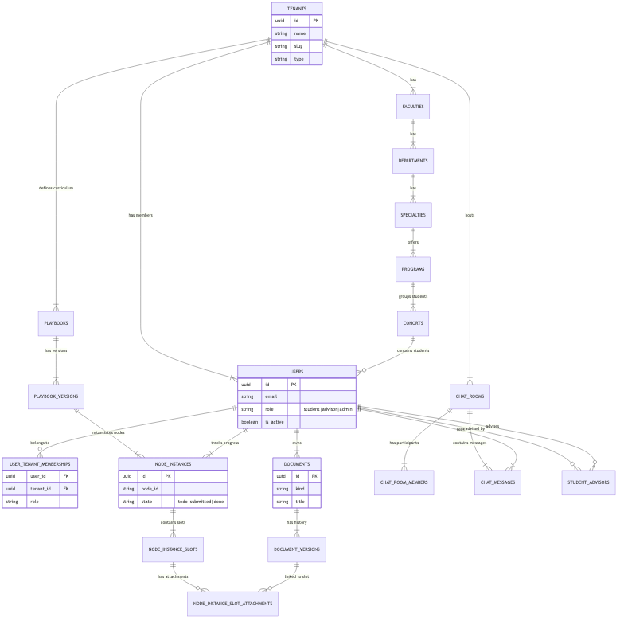
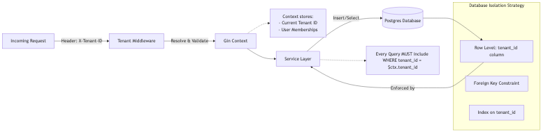
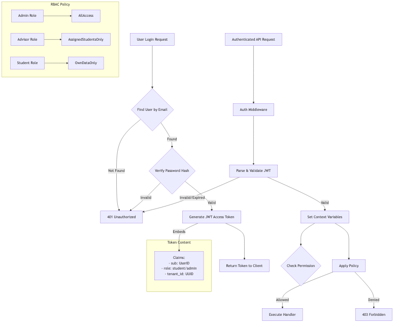
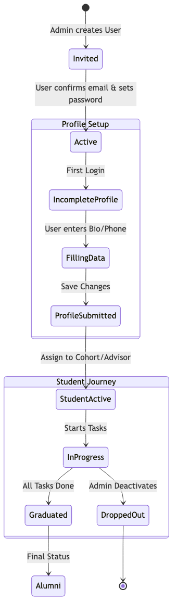
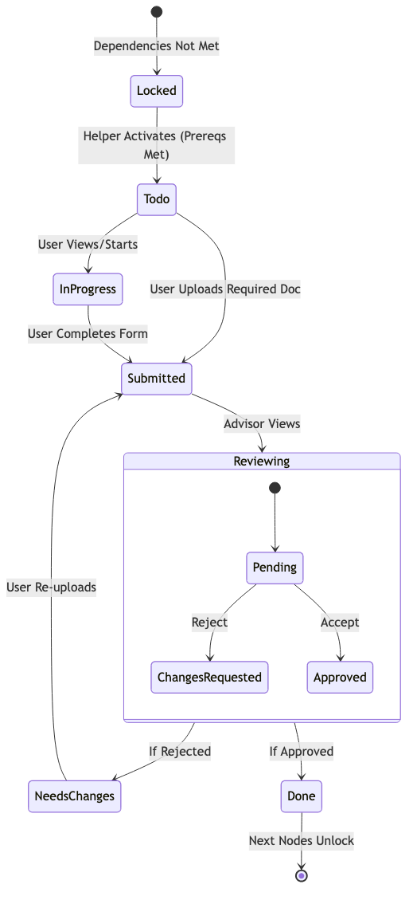
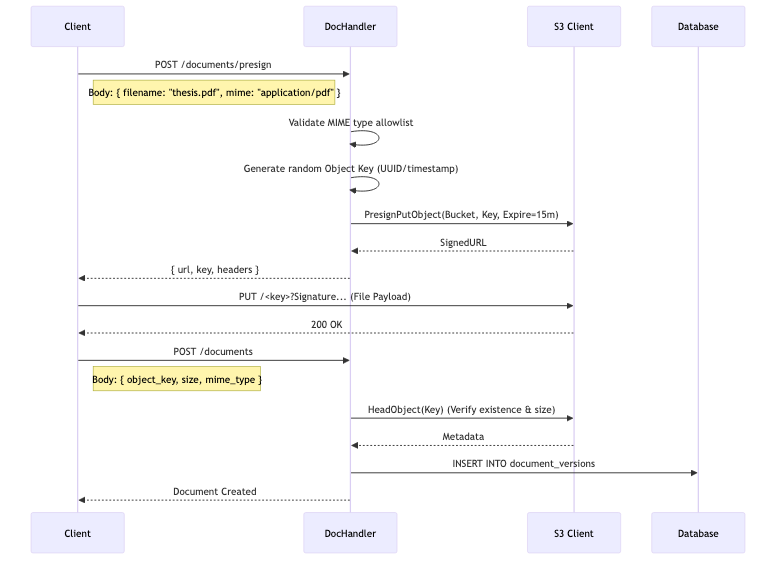
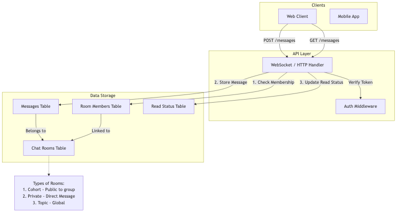
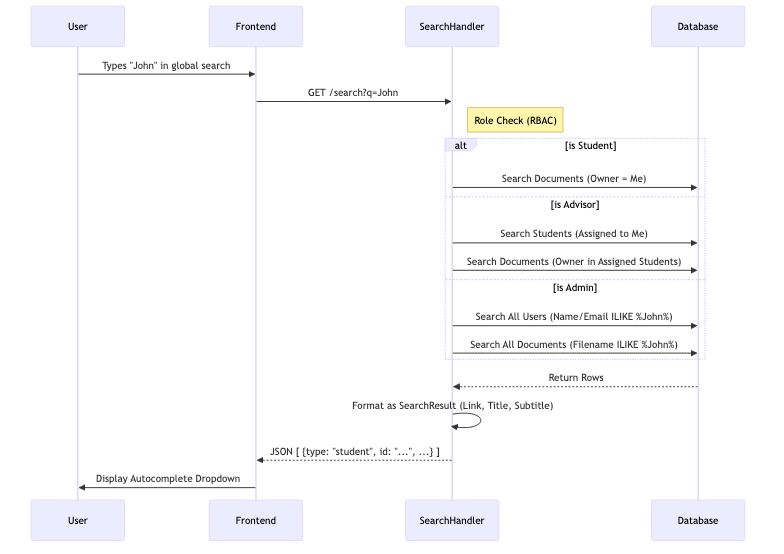

# Application Backend Information

This document provides a deep technical dive into the backend architecture of the PhD Student Portal. It details the system's core components, security models, data structures, and operational workflows, supported by high-fidelity diagrams and concrete examples.

## Table of Contents
1.  [Architecture Overview](#architecture-overview)
2.  [Database Schema](#database-schema)
3.  [Multitenancy & Isolation](#multitenancy--isolation)
4.  [Authentication & RBAC](#authentication--rbac)
5.  [User Management & Onboarding](#user-management--onboarding)
6.  [Core Services](#core-services)
    *   [Journey Map & Node Progression](#journey-map--node-progression)
    *   [Document Management (S3)](#document-management-s3)
    *   [Messaging (Chat)](#messaging-chat)
    *   [Search Workflow](#search-workflow)
7.  [Workflows](#workflows)
    *   [Document Approval Flow](#document-approval-flow)

---

## Architecture Overview
The backend is a monolithic application written in **Go (Golang)**, designed for high performance and strict type safety. It uses the **Gin Web Framework** for HTTP routing and middleware management.

**Technology Stack:**
*   **Language**: Go 1.23+
*   **Database**: PostgreSQL 16 (Relational Data)
*   **Storage**: MinIO / S3 (Object Storage)
*   **Auth**: JWT (Stateless)
*   **Migrations**: SQL-based (golang-migrate)

---

## Database Schema
The database is normalized to ensure data integrity. The schema is centered around the `tenants` table, which partitions all data, and the `users` table, which holds global identity information.



### Description
*   **Tenants**: The root entity. Every university is a tenant.
*   **Users & Memberships**: Users exist globally but have specific roles within specific tenants via `user_tenant_memberships`.
    *   *Example*: A user can be a "Student" in Tenant A and an "Advisor" in Tenant B.
*   **Journey Nodes (`node_instances`)**: Represents the state of a single task for a single student.
*   **Documents**: Metadata for files. The actual binary content stays in S3.
*   **Chat**: Rooms are scoped to tenants. Messages belong to rooms.

---

## Multitenancy & Isolation
The application is **Multi-Tenant**, meaning a single running instance serves multiple universities while keeping their data strictly isolated.



### How it Works
1.  **Request Arrival**: Every HTTP request must carry the target tenant context.
    *   **Header**: `X-Tenant-ID: <UUID>`
    *   **Subdomain**: `university-a.portal.com` (Mapped to Tenant ID)
2.  **Middleware resolution**: The `TenantMiddleware` validates the ID against the active tenants cache.
3.  **Context Injection**: The `tenant_id` is stored in the Gin Context.
4.  **Database Enforcement**: Service layer functions **MUST** include `tenant_id` in every `WHERE` clause.

**Example: Secure Query**
```sql
-- CORRECT: Fetches only students for the active tenant
SELECT * FROM users u
JOIN user_tenant_memberships utm ON u.id = utm.user_id
WHERE utm.tenant_id = '123e4567-e89b-12d3-a456-426614174000';
```

---

## Authentication & RBAC
Security is handled via **JSON Web Tokens (JWT)**. The system is stateless; every request is authenticated independently.



### Token Structure
When a user logs in, they receive an Access Token containing their identity and permissions.

**Example Decoded JWT Payload:**
```json
{
  "sub": "a1b2c3d4-...",       // User ID
  "role": "student",           // Current Active Role
  "tenant_id": "123e...",      // Current Active Tenant
  "exp": 1735689600            // Expiration Timestamp
}
```

### Role-Based Access Control (RBAC)
Policies are enforced at the handler level.
*   **Student**: Read-only access to own data. Write access to own submissions.
*   **Advisor**: Read access to assigned students. Write access to reviews.
*   **Admin**: Full Read/Write within their tenant.

---

## User Management & Onboarding
Users transition through several states before becoming fully active participants.



### State Flow Description
1.  **Invited**: An admin sends an invitation email. The user record exists but has no password and `is_active = false`.
2.  **Active**: The user clicks the link, sets a password, and verifies their email. They can now log in.
3.  **Incomplete Profile**: The user enters the portal but hasn't provided necessary details (Phone, Bio).
4.  **Profile Submitted**: The user completes their profile.
5.  **Student Active**: An admin assigns the user to a **Cohort** and an **Advisor**. They are now fully operational.
6.  **Alumni**: Use case for graduated students who retain read-only access.

---

## Core Services

### Journey Map & Node Progression
The "Journey" is the core feature for PhD students. It tracks their progress through a predefined set of tasks (Nodes).



### Node States
*   **Locked**: The student cannot see or interact with this task. (Dependency not met).
*   **Todo**: The task is available. The system is waiting for the student to act.
*   **Submitted**: The student has uploaded a document or filled a form. Waiting for advisor review.
*   **Reviewing**: The advisor has opened the submission.
*   **Needs Changes**: The advisor rejected the submission. The student must re-submit.
*   **Done**: The advisor approved the submission. The next node unlocks.

**Example Node JSON (from Playbook):**
```json
{
  "id": "thesis_proposal",
  "title": "Upload Thesis Proposal",
  "type": "upload",
  "dependencies": ["literature_review"] // Won't unlock until literature_review is Done
}
```

### Document Management (S3)
We utilize **Pre-Signed URLs** to allow secure, direct uploads from the Frontend to S3. This reduces load on the backend API.



**Workflow Example:**
1.  Frontend asks: "I want to upload `thesis.pdf` (5MB)"
2.  Backend responds: "Here is a secure URL `https://s3.aws.com/...`, it expires in 15 minutes."
3.  Frontend uploads the file directly to that URL.
4.  Frontend tells Backend: "Upload complete."
5.  Backend verifies the file exists in S3 and creates a record in the `documents` table.

### Messaging (Chat)
The chat architecture supports multiple room types.



**Room Types:**
*   **Cohort**: Public room for all students in the same year/program.
*   **Private**: Direct 1-on-1 messaging (e.g., Student <-> Advisor).
*   **Topic**: Tenant-wide channels (e.g., "General", "Announcements").

**Message Flow:**
1.  User posts message to `POST /chat/rooms/{id}/messages`.
2.  Backend stores message.
3.  (Future) WebSocket broadcasts event to online members.
4.  Recipients see the message and mark it as read via `POST /read`.

### Search Workflow
The Global Search is a unified entry point for finding resources.



**Capabilities:**
*   **Admins**: Can search for any Student by name/email, and any Document by filename.
*   **Advisors**: Can search only for *Students assigned to them* and their documents.
*   **Students**: Can search only their *own* documents and public resources.

**Example Response:**
```json
[
  {
    "type": "student",
    "title": "Alice Smith",
    "subtitle": "Cohort 2024",
    "link": "/admin/students/uuid-..."
  },
  {
    "type": "document",
    "title": "Thesis_Draft_Final.pdf",
    "subtitle": "Alice Smith",
    "link": "/documents/uuid-..."
  }
]
```

---

## Workflows

### Document Approval Flow
This is the most critical business process, connecting Students and Advisors.


**Detailed Steps:**
1.  **Submission**: Student uploads a file to a Node Slot. The Node state updates to `Submitted`.
2.  **Notification**: The system detects the state change and creates a notification for all assigned Advisors.
3.  **Review**: The Advisor clicks the notification, views the document in the browser.
4.  **Decision**:
    *   **Approve**: The Advisor leaves an optional "Good job" note. The Node becomes `Done`. The Student is notified.
    *   **Request Changes**: The Advisor leaves a mandatory comment "Fix bibliography". The Node becomes `Needs Changes`. The Student is notified and must re-upload.
