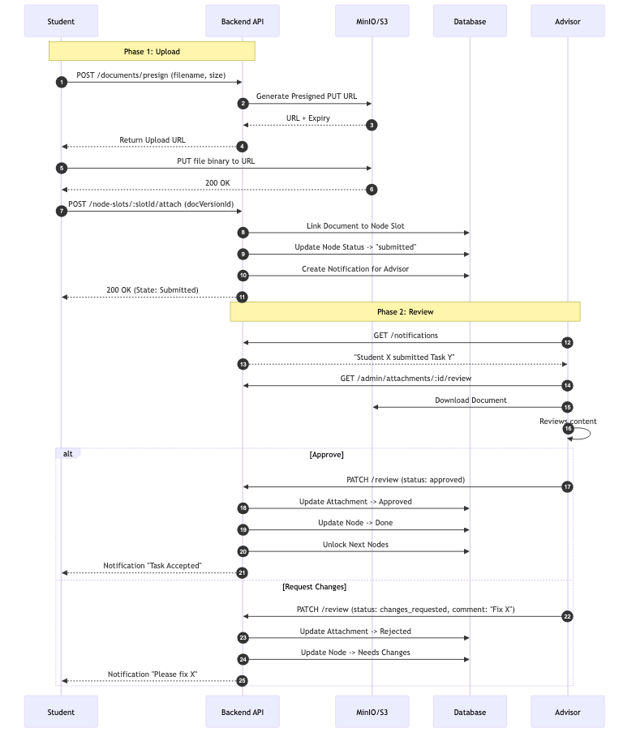

# KazNMU PhD Student Portal: Digital Transformation of Doctoral Education

## Executive Summary
The **KazNMU PhD Student Portal** is a comprehensive digital platform designed to modernize and streamline the lifecycle of doctoral programs at Asfendiyarov Kazakh National Medical University. By replacing fragmented manual processes with a unified digital ecosystem, the portal ensures transparency, accountability, and efficiency for students, advisors, and university administration.

This platform is not just an administrative tool; it is a **Student Success System** that guides doctoral candidates from admission to defense, ensuring they meet every academic and research milestone on time.

---

## What Problem Does It Solve?
Traditionally, doctoral programs suffer from:
*   **Bureaucratic Opacity:** Students struggle to understand complex requirements and deadlines.
*   **Manual Paperwork:** Physical documents get lost, and approvals take weeks.
*   **Lack of Oversight:** It is difficult for the Ministry and Rectors to track the real-time progress of hundreds of doctoral students.
*   **Disconnected Communication:** Feedback from advisors is often delayed or unstructured.

**The PhD Student Portal solves this by digitizing the entire process.**

---

## The Perfect Companion for the PhD Journey

The application is designed to be more than just a database; it is a proactive assistants helping students navigate the complexity of doctoral studies.

### 1. Visual & Gamified Progress ("The Journey")
PhD programs can feel disjointed and endless. We solve this by visualizing the entire doctoral lifecycle as a **"Journey Map"**—similar to a game level or a subway map.
*   **Visual Guidance:** Students see their path from "Admission" to "Defense" as a series of clear, achievable steps (Nodes).
*   **Gamified Experience:** Completing tasks turns nodes green, giving a sense of accomplishment and momentum. A "Scoreboard" style progress bar shows exactly how close they are to graduation (e.g., "35% Complete").
*   **Clarity:** Instead of reading 100-page regulations, students simply look at their map to see *"What do I do next?"*.

### 2. A Complete Communication Ecosystem
We replace informal WhatsApp groups with a professional, integrated communication hub.
*   **Chat Groups:** Dedicated spaces for "Cohort 2024", "Cardiology Residents", or "Ethics Committee", fostering peer support and fast information sharing.
*   **Direct Access:** Students can easily find and message their Scientific Supervisors, Department Heads, or Administrators from a verified **Contact List**.
*   **Smart Notifications:** The system proactively nudges students about approaching deadlines, new document reviews, or unread messages, ensuring they never miss a beat.

### 3. Integrated Organizational Tools
The portal centralizes all the logistical tools a researcher needs in one place.
*   **Smart Calendar:** Automatically syncs defense dates, exam schedules, and department meetings.
*   **Templates & Forms:** No more searching for "that one document." The system provides the correct, up-to-date templates for every required form (protocols, applications, reports) right when the student needs them.
*   **Checklists:** Complex procedures like "Preparing for Defense" are broken down into simple, interactive checklists to ensure full compliance.

### 4. Digital Document Workflow
*   **Paperless Submission:** Students upload dissertations, articles, and reports directly to the secure portal.
*   **Streamlined Review:** Advisors receive instant alerts to review work. They can approve or request changes with specific comments directly in the file history.
*   **Version Control:** The system acts as a secure vault, keeping every version of every document safe forever.

### 5. Real-Time Analytics (The "Scoreboard" for Leadership)
*   **For the University:** Dashboards show real-time graduation rates, on-time completion statistics, and identify stalled students.
*   **For the Ministry:** Access reliable, high-level data on the efficacy of doctoral programs to inform national policy decisions.

---

## Why Is This Application Innovative?

### 🌟 Active Guidance, Not Just Record Keeping
Unlike traditional "electronic archives" that just store files, this system **actively manages the process**. It enforces deadlines, prevents skipping steps, and automatically notifies stakeholders when action is needed. It acts as a digital mentor.

### 🔒 Transparency & Anti-Corruption
By digitizing every approval and document submission, the system creates an **immutable digital audit trail**.
*   Every decision (approval/rejection) is recorded.
*   Deadlines are enforced systematically.
*   This transparency significantly reduces opportunities for unfair practices or bureaucratic delays.

### 🤖 Future-Ready AI Integration
The platform is built to support **AI-driven assistance**. Future modules will include:
*   **AI Compliance Checks:** Automatically checking uploaded documents against formatting and structural requirements.
*   **Smart Recommendations:** Suggesting relevant research materials or grant opportunities based on the student's thesis topic.

---

## Strategic Impact

Implementing this system achieves several key goals for the Ministry of Education:
1.  **Digital Transformation:** Demonstrates a concrete step towards the digitization of higher education management.
2.  **Quality Assurance:** Ensures that all PhD graduates have rigorously met every standard of their program.
3.  **Data-Driven Decision Making:** Provides reliable data to evaluate the success of research programs and allocate resources effectively.
4.  **Student Support:** Drastically reduces the administrative burden on young scientists, allowing them to focus on high-impact research.
