# System Flow Diagrams

This document provides visual flow diagrams for all major processes in the PhD Student Portal application.

---

## Table of Contents

1. [Document Approval Workflow](#1-document-approval-workflow)
2. [Chat Messaging Flow](#2-chat-messaging-flow)
3. [Calendar Events Flow](#3-calendar-events-flow)
4. [Notifications Flow](#4-notifications-flow)
5. [S3 Document Upload/Download](#5-s3-document-uploaddownload)
6. [Authentication Flow](#6-authentication-flow)
7. [Student Journey Progression](#7-student-journey-progression)

---

## 1. Document Approval Workflow

### Overview
Students submit documents for advisor review. Advisors can approve, reject, or approve with comments. All assigned advisors receive notifications.

### Flow Diagram

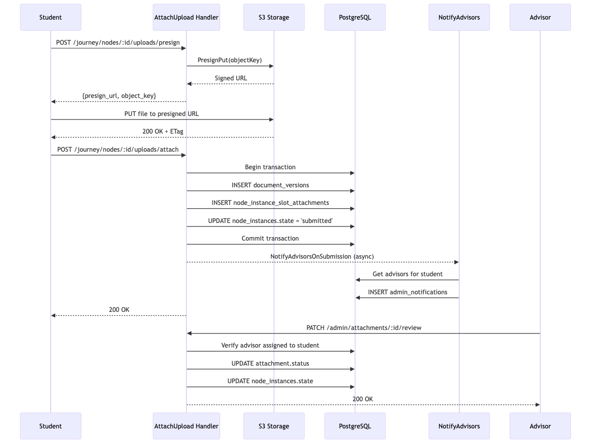

<details>
<summary>Mermaid Source</summary>

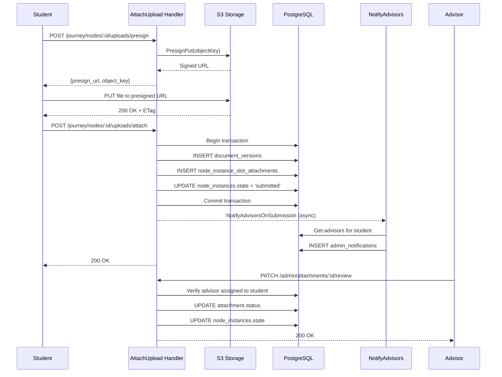
```mermaid
sequenceDiagram
    participant S as Student
    participant API as AttachUpload Handler
    participant S3 as S3 Storage
    participant DB as PostgreSQL
    participant N as NotifyAdvisors
    participant A as Advisor

    S->>API: POST /journey/nodes/:id/uploads/presign
    API->>S3: PresignPut(objectKey)
    S3-->>API: Signed URL
    API-->>S: {presign_url, object_key}
    
    S->>S3: PUT file to presigned URL
    S3-->>S: 200 OK + ETag
    
    S->>API: POST /journey/nodes/:id/uploads/attach
    API->>DB: Begin transaction
    API->>DB: INSERT document_versions
    API->>DB: INSERT node_instance_slot_attachments
    API->>DB: UPDATE node_instances.state = 'submitted'
    API->>DB: Commit transaction
    API-->>N: NotifyAdvisorsOnSubmission (async)
    N->>DB: Get advisors for student
    N->>DB: INSERT admin_notifications
    API-->>S: 200 OK
    
    A->>API: PATCH /admin/attachments/:id/review
    API->>DB: Verify advisor assigned to student
    API->>DB: UPDATE attachment.status
    API->>DB: UPDATE node_instances.state
    API-->>A: 200 OK
```
</details>

### Status Mappings

| Attachment Status | → Node State |
|-------------------|--------------|
| `submitted` | `under_review` |
| `approved` | `done` |
| `approved_with_comments` | `done` |
| `rejected` | `needs_fixes` |

---

## 2. Chat Messaging Flow

### Overview
Real-time chat between students, advisors, and admins. Supports rooms, direct messages, file attachments, and read receipts.

### Message Flow

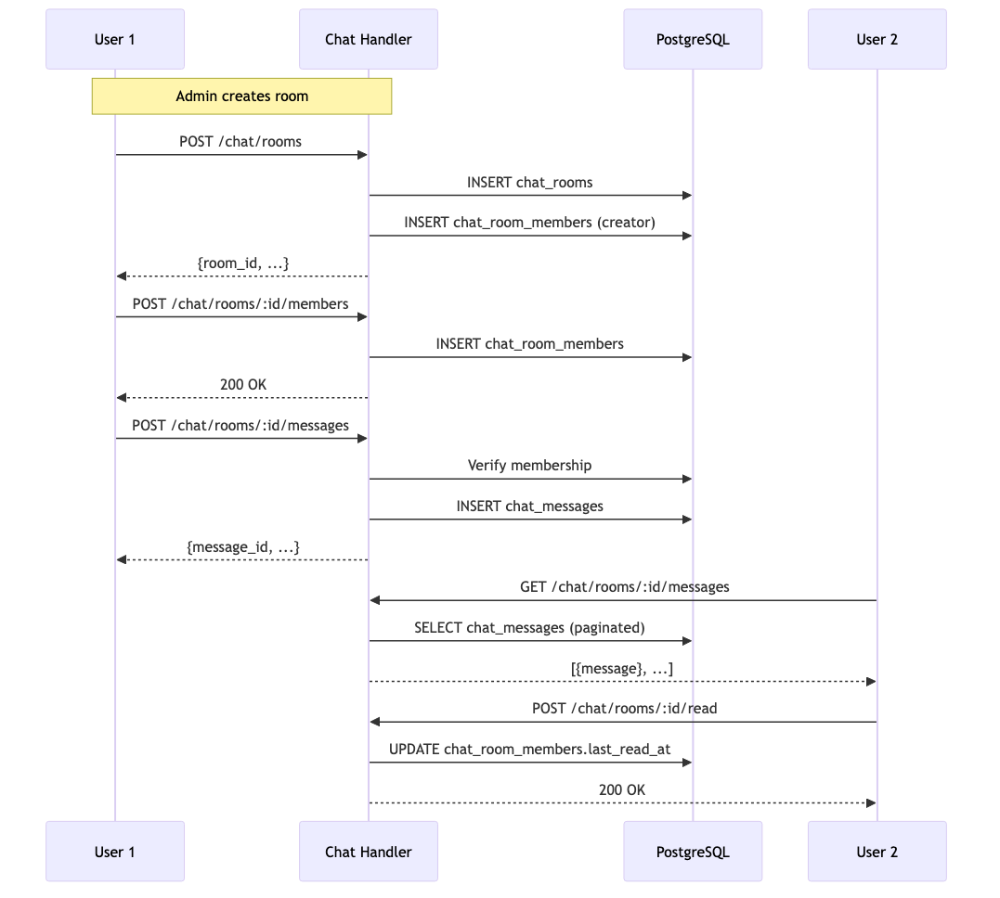

<details>
<summary>Mermaid Source</summary>

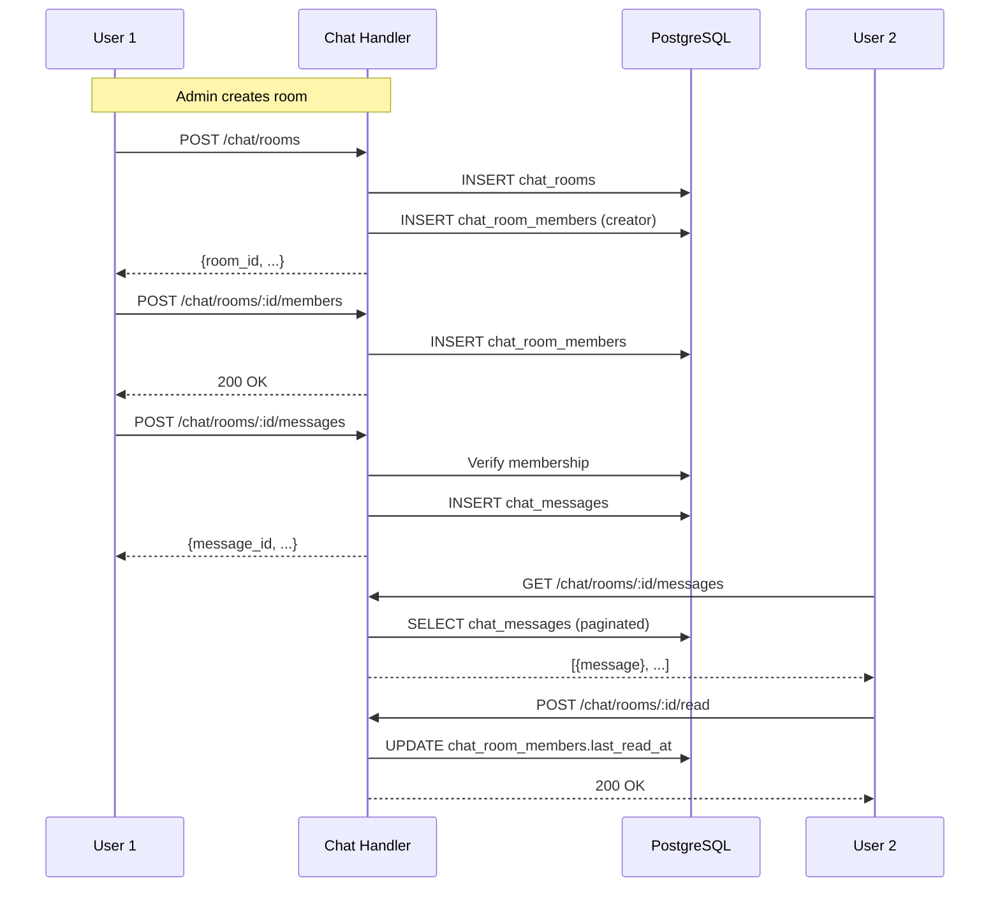
```mermaid
sequenceDiagram
    participant U1 as User 1
    participant API as Chat Handler
    participant DB as PostgreSQL
    participant U2 as User 2

    Note over U1,API: Admin creates room
    U1->>API: POST /chat/rooms
    API->>DB: INSERT chat_rooms
    API->>DB: INSERT chat_room_members (creator)
    API-->>U1: {room_id, ...}
    
    U1->>API: POST /chat/rooms/:id/members
    API->>DB: INSERT chat_room_members
    API-->>U1: 200 OK
    
    U1->>API: POST /chat/rooms/:id/messages
    API->>DB: Verify membership
    API->>DB: INSERT chat_messages
    API-->>U1: {message_id, ...}
    
    U2->>API: GET /chat/rooms/:id/messages
    API->>DB: SELECT chat_messages (paginated)
    API-->>U2: [{message}, ...]
    
    U2->>API: POST /chat/rooms/:id/read
    API->>DB: UPDATE chat_room_members.last_read_at
    API-->>U2: 200 OK
```
</details>

### File Attachment Flow

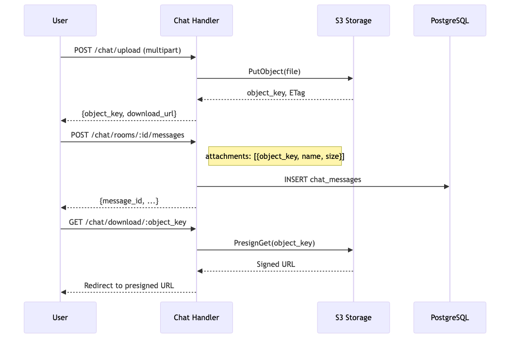

<details>
<summary>Mermaid Source</summary>

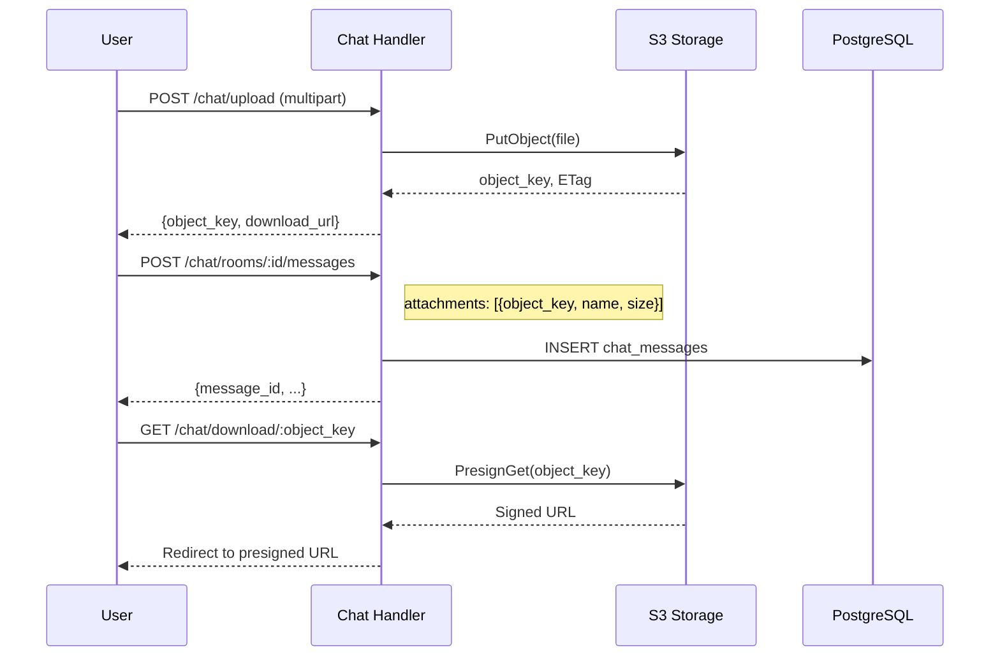
```mermaid
sequenceDiagram
    participant U as User
    participant API as Chat Handler
    participant S3 as S3 Storage
    participant DB as PostgreSQL

    U->>API: POST /chat/upload (multipart)
    API->>S3: PutObject(file)
    S3-->>API: object_key, ETag
    API-->>U: {object_key, download_url}
    
    U->>API: POST /chat/rooms/:id/messages
    Note right of API: attachments: [{object_key, name, size}]
    API->>DB: INSERT chat_messages
    API-->>U: {message_id, ...}
    
    U->>API: GET /chat/download/:object_key
    API->>S3: PresignGet(object_key)
    S3-->>API: Signed URL
    API-->>U: Redirect to presigned URL
```
</details>

---

## 3. Calendar Events Flow

### Overview
Admins/advisors can create calendar events visible to students based on permissions and scope.

### Event CRUD Flow


<details>
<summary>Mermaid Source</summary>

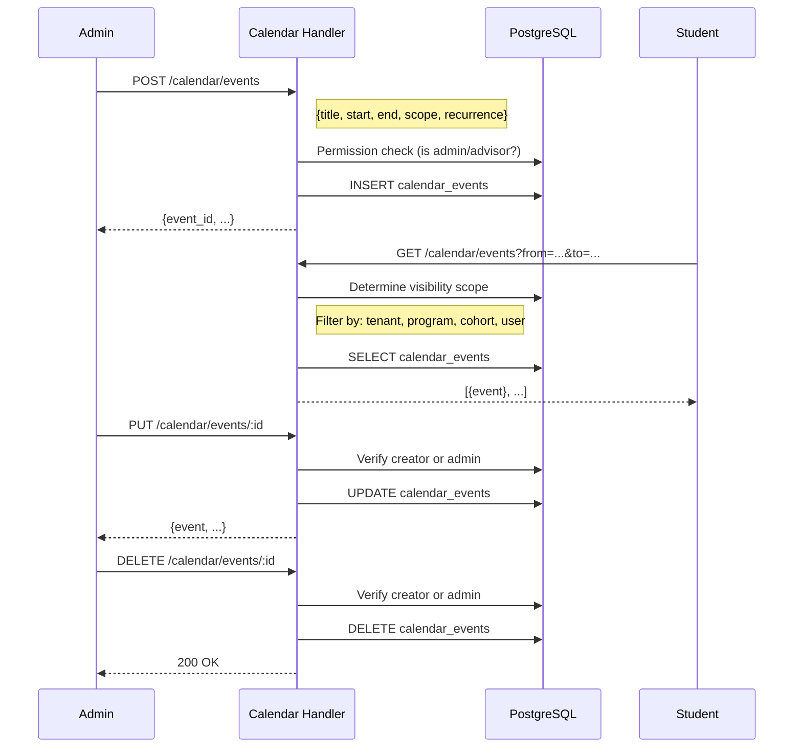
```mermaid
sequenceDiagram
    participant A as Admin
    participant API as Calendar Handler
    participant DB as PostgreSQL
    participant S as Student

    A->>API: POST /calendar/events
    Note right of API: {title, start, end, scope, recurrence}
    API->>DB: Permission check (is admin/advisor?)
    API->>DB: INSERT calendar_events
    API-->>A: {event_id, ...}
    
    S->>API: GET /calendar/events?from=...&to=...
    API->>DB: Determine visibility scope
    Note right of API: Filter by: tenant, program, cohort, user
    API->>DB: SELECT calendar_events
    API-->>S: [{event}, ...]
    
    A->>API: PUT /calendar/events/:id
    API->>DB: Verify creator or admin
    API->>DB: UPDATE calendar_events
    API-->>A: {event, ...}
    
    A->>API: DELETE /calendar/events/:id
    API->>DB: Verify creator or admin
    API->>DB: DELETE calendar_events
    API-->>A: 200 OK
```
</details>

### Event Visibility Rules

| Scope | Visible To |
|-------|------------|
| `tenant` | All users in tenant |
| `program` | Users in specific program |
| `cohort` | Users in specific cohort |
| `personal` | Creator + specific attendees |

---

## 4. Notifications Flow

### Overview
Two notification systems: user notifications (bell icon) and admin notifications (review queue).

### User Notification Flow

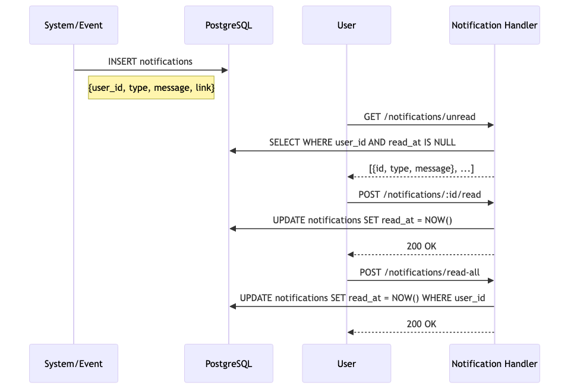

<details>
<summary>Mermaid Source</summary>

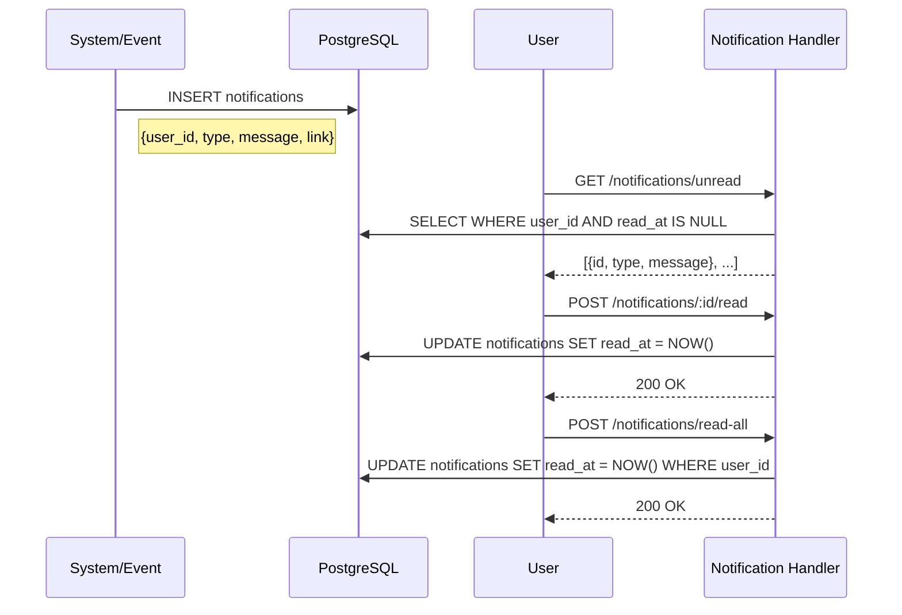
```mermaid
sequenceDiagram
    participant SYS as System/Event
    participant DB as PostgreSQL
    participant U as User
    participant API as Notification Handler

    SYS->>DB: INSERT notifications
    Note right of SYS: {user_id, type, message, link}
    
    U->>API: GET /notifications/unread
    API->>DB: SELECT WHERE user_id AND read_at IS NULL
    API-->>U: [{id, type, message}, ...]
    
    U->>API: POST /notifications/:id/read
    API->>DB: UPDATE notifications SET read_at = NOW()
    API-->>U: 200 OK
    
    U->>API: POST /notifications/read-all
    API->>DB: UPDATE notifications SET read_at = NOW() WHERE user_id
    API-->>U: 200 OK
```
</details>

### Notification Types

| Type | Trigger | Target |
|------|---------|--------|
| `document_submitted` | Student uploads | Assigned advisors |
| `document_reviewed` | Advisor approves/rejects | Student |
| `deadline_reminder` | Cron job | Students with upcoming deadlines |
| `chat_mention` | @mention in chat | Mentioned user |

---

## 5. S3 Document Upload/Download

### Overview
All files are stored in S3 (MinIO in dev). The API generates presigned URLs for secure direct access.

### Upload Flow (Presign Pattern)

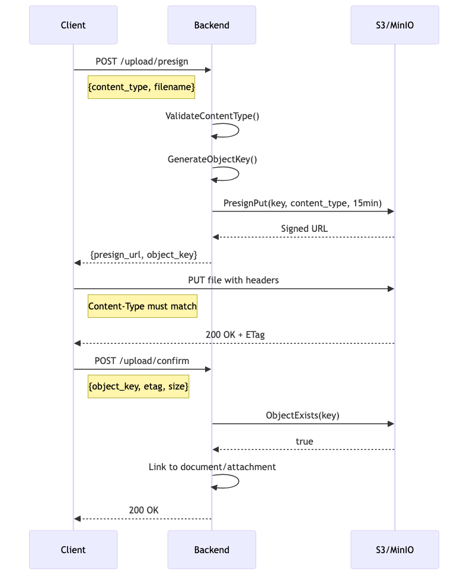

<details>
<summary>Mermaid Source</summary>

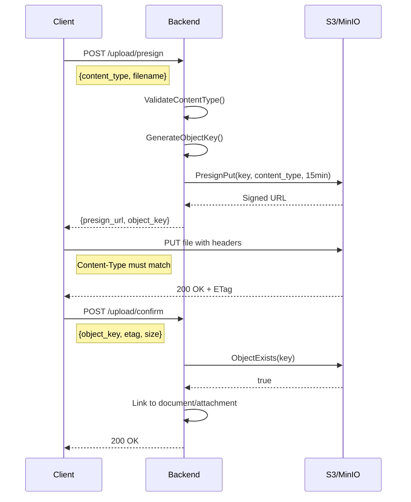
```mermaid
sequenceDiagram
    participant C as Client
    participant API as Backend
    participant S3 as S3/MinIO

    C->>API: POST /upload/presign
    Note right of C: {content_type, filename}
    API->>API: ValidateContentType()
    API->>API: GenerateObjectKey()
    API->>S3: PresignPut(key, content_type, 15min)
    S3-->>API: Signed URL
    API-->>C: {presign_url, object_key}
    
    C->>S3: PUT file with headers
    Note right of C: Content-Type must match
    S3-->>C: 200 OK + ETag
    
    C->>API: POST /upload/confirm
    Note right of C: {object_key, etag, size}
    API->>S3: ObjectExists(key)
    S3-->>API: true
    API->>API: Link to document/attachment
    API-->>C: 200 OK
```
</details>

### Download Flow

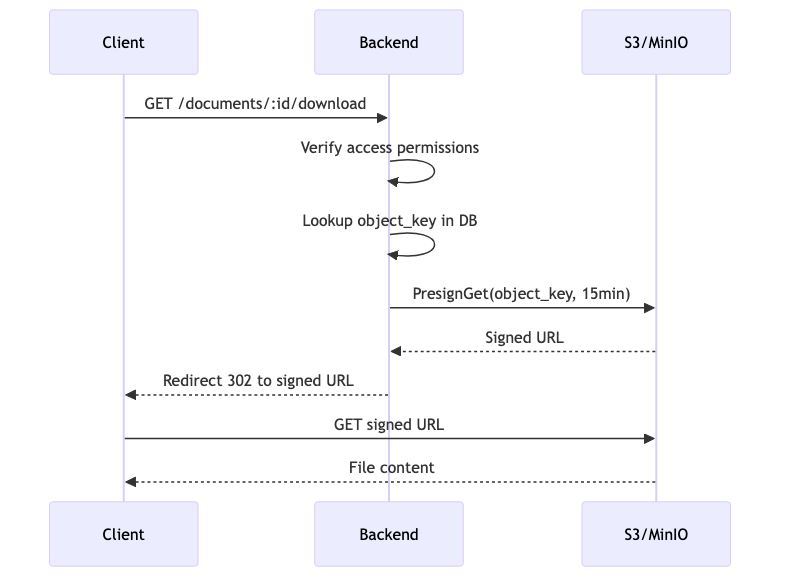

<details>
<summary>Mermaid Source</summary>

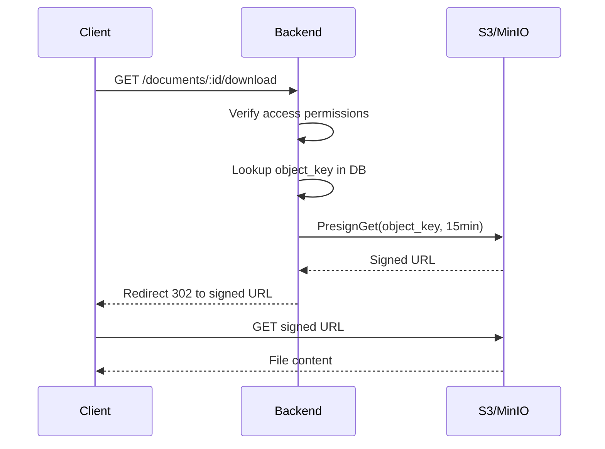
```mermaid
sequenceDiagram
    participant C as Client
    participant API as Backend
    participant S3 as S3/MinIO

    C->>API: GET /documents/:id/download
    API->>API: Verify access permissions
    API->>API: Lookup object_key in DB
    API->>S3: PresignGet(object_key, 15min)
    S3-->>API: Signed URL
    API-->>C: Redirect 302 to signed URL
    
    C->>S3: GET signed URL
    S3-->>C: File content
```
</details>

### S3 Configuration

| Env Variable | Purpose |
|--------------|---------|
| `S3_BUCKET` | Bucket name |
| `S3_ENDPOINT` | MinIO URL (dev) or AWS S3 |
| `S3_ACCESS_KEY_ID` | Access credentials |
| `S3_SECRET_ACCESS_KEY` | Secret credentials |
| `S3_PRESIGN_EXPIRES_MINUTES` | URL validity (default: 15) |

---

## 6. Authentication Flow

### Overview
JWT-based authentication with refresh tokens. Supports multitenancy via X-Tenant-Slug header.

### Login Flow

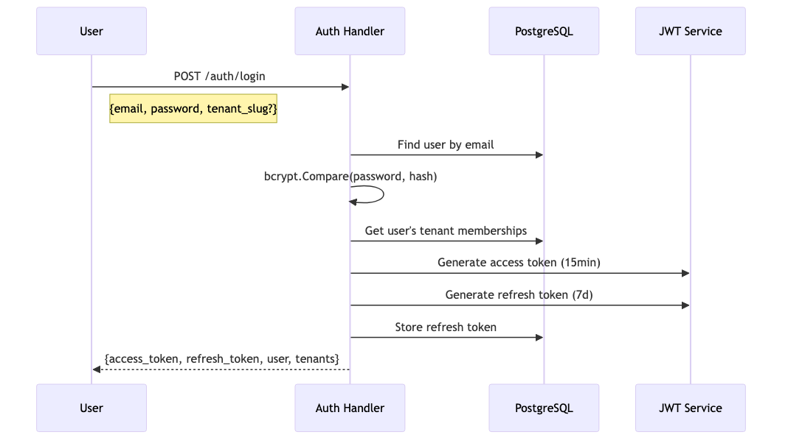

<details>
<summary>Mermaid Source</summary>

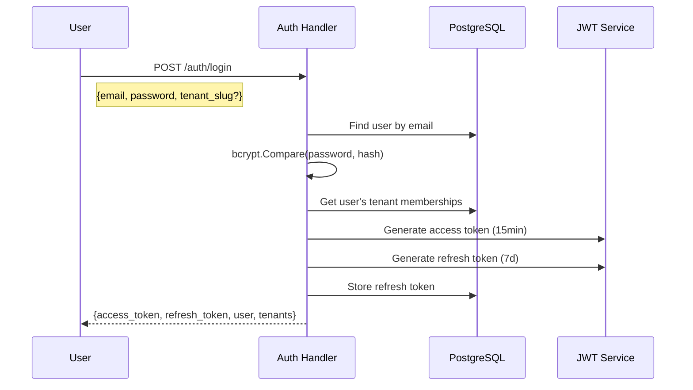
```mermaid
sequenceDiagram
    participant U as User
    participant API as Auth Handler
    participant DB as PostgreSQL
    participant JWT as JWT Service

    U->>API: POST /auth/login
    Note right of U: {email, password, tenant_slug?}
    API->>DB: Find user by email
    API->>API: bcrypt.Compare(password, hash)
    API->>DB: Get user's tenant memberships
    API->>JWT: Generate access token (15min)
    API->>JWT: Generate refresh token (7d)
    API->>DB: Store refresh token
    API-->>U: {access_token, refresh_token, user, tenants}
```
</details>

### JWT Claims

```json
{
  "sub": "user_id",
  "email": "user@example.com",
  "role": "student|advisor|admin|superadmin",
  "tenant_id": "uuid",
  "is_superadmin": false,
  "exp": 1234567890
}
```

---

## 7. Student Journey Progression

### Overview
Students progress through a playbook of nodes (tasks). Nodes can have prerequisites, deadlines, and different types.

### Node State Machine

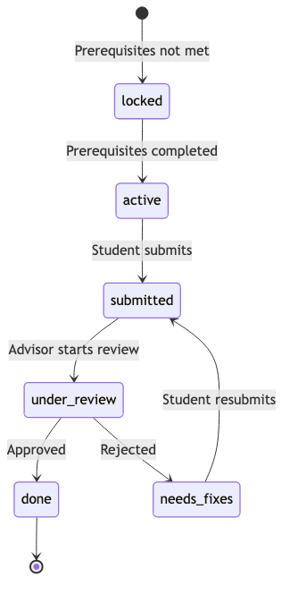

<details>
<summary>Mermaid Source</summary>

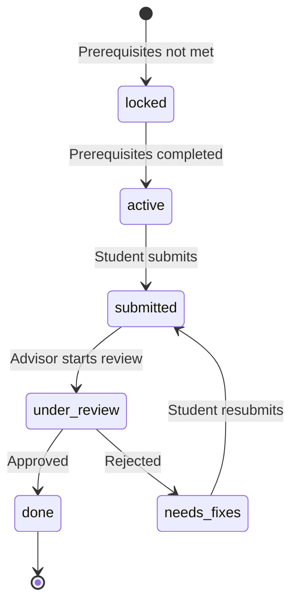
```mermaid
stateDiagram-v2
    [*] --> locked: Prerequisites not met
    locked --> active: Prerequisites completed
    active --> submitted: Student submits
    submitted --> under_review: Advisor starts review
    under_review --> done: Approved
    under_review --> needs_fixes: Rejected
    needs_fixes --> submitted: Student resubmits
    done --> [*]
```
</details>

### Journey Progression Flow

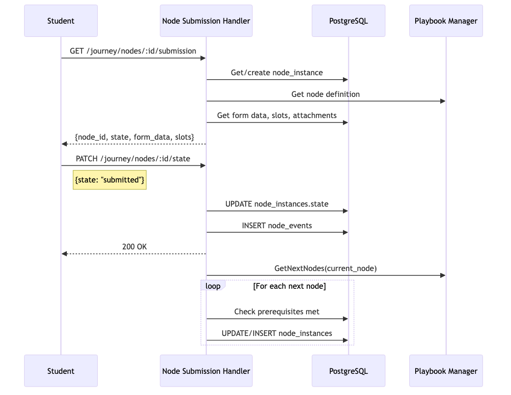

<details>
<summary>Mermaid Source</summary>

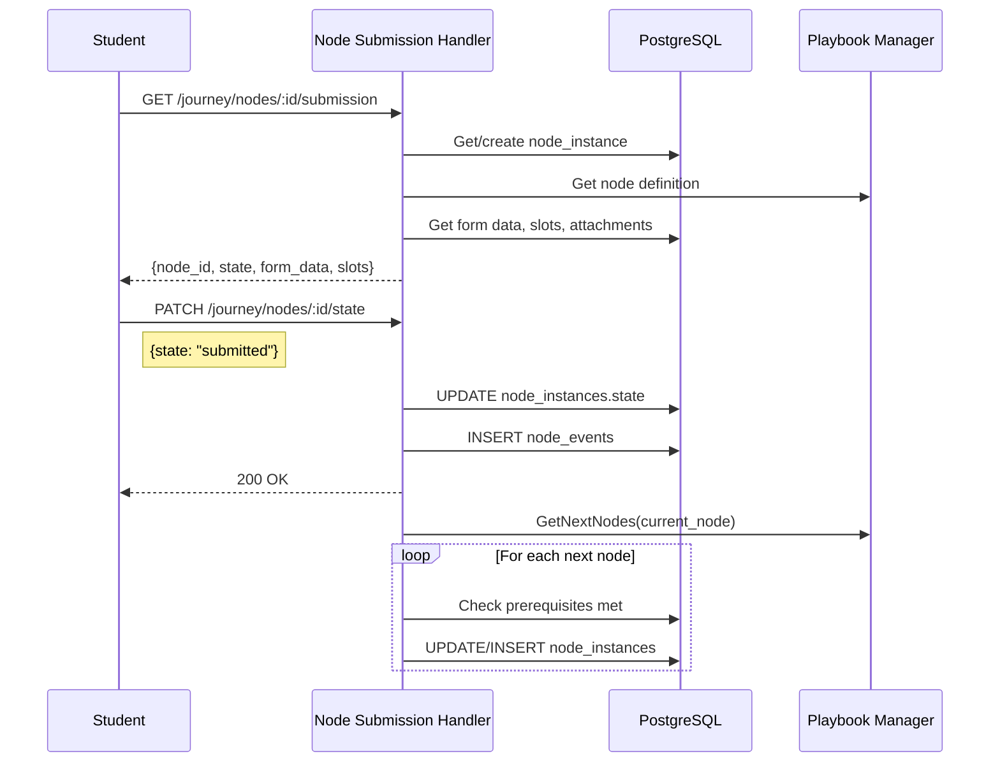
```mermaid
sequenceDiagram
    participant S as Student
    participant API as Node Submission Handler
    participant DB as PostgreSQL
    participant PB as Playbook Manager

    S->>API: GET /journey/nodes/:id/submission
    API->>DB: Get/create node_instance
    API->>PB: Get node definition
    API->>DB: Get form data, slots, attachments
    API-->>S: {node_id, state, form_data, slots}
    
    S->>API: PATCH /journey/nodes/:id/state
    Note right of S: {state: "submitted"}
    API->>DB: UPDATE node_instances.state
    API->>DB: INSERT node_events
    API-->>S: 200 OK
    
    API->>PB: GetNextNodes(current_node)
    loop For each next node
        API->>DB: Check prerequisites met
        API->>DB: UPDATE/INSERT node_instances
    end
```
</details>

---

## Quick Reference

### API Endpoints Summary

| Module | Method | Endpoint | Description |
|--------|--------|----------|-------------|
| Auth | POST | `/auth/login` | Login |
| Auth | POST | `/auth/refresh` | Refresh token |
| Journey | GET | `/journey/nodes/:id/submission` | Get node state |
| Journey | PATCH | `/journey/nodes/:id/state` | Update state |
| Journey | POST | `/journey/nodes/:id/uploads/attach` | Attach file |
| Admin | PATCH | `/admin/attachments/:id/review` | Review doc |
| Chat | GET | `/chat/rooms` | List rooms |
| Chat | POST | `/chat/rooms/:id/messages` | Send message |
| Calendar | GET | `/calendar/events` | List events |
| Calendar | POST | `/calendar/events` | Create event |
| Notifications | GET | `/notifications/unread` | Get unread |
