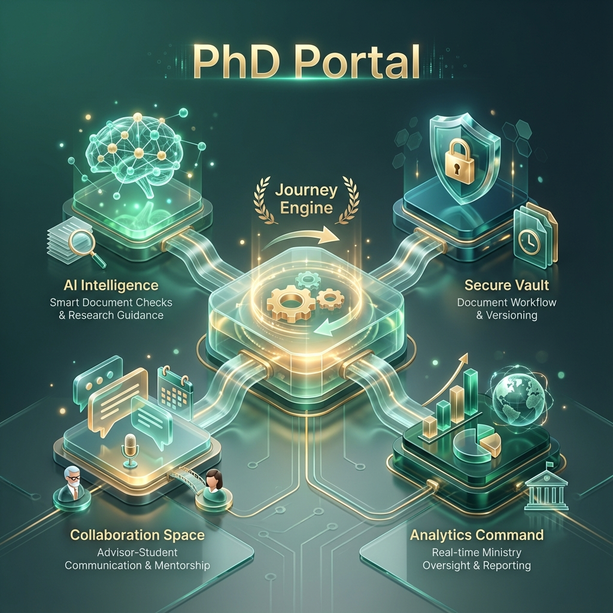
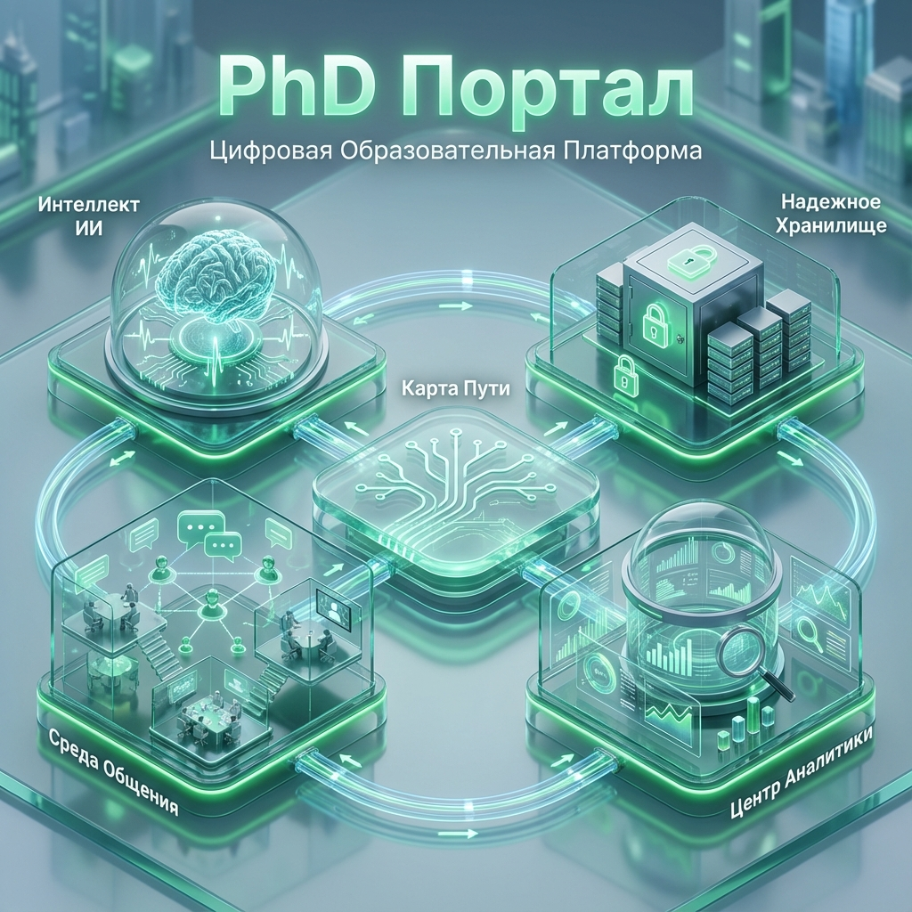

# PhD Portal: High-Level Architecture Overview

The **PhD Portal** is a next-generation "Student Success System" designed to modernize doctoral education. It moves beyond simple record-keeping to provide active, AI-enhanced guidance for students, advisors, and university leadership.

## Версия на русском языке (Russian Version)

## Core Architectural Pillars

### 1. Journey Engine (The Heart)
At the center of the application is the **Journey Engine**. This system visualizes the entire PhD lifecycle as a sequence of milestones—from admission to final defense. It ensures that every student follows an approved path, automatically unlocking next steps only when prerequisites are met.

### 2. AI Intelligence (The Brain)
The portal is built for the future with integrated AI capabilities:
- **Smart Document Checks:** AI pre-reviews uploaded dissertations and reports to ensure they meet formatting and regulatory standards before an advisor even sees them.
- **Smart Navigator (RAG):** A knowledge assistant grounded in university regulations and research documents, providing students with instant, cited answers to complex procedural questions.
- **Predictive Success:** Future modules will identify students at risk of falling behind based on progress patterns, allowing for proactive intervention.

### 3. Secure Vault (The Foundation)
A robust document management layer that provides:
- **Immutable Versioning:** Every draft and final document is saved with a complete history, ensuring an unshakeable audit trail.
- **Unified Templates:** One-click access to verified, up-to-date forms and protocols required by the university.

### 4. Collaboration Space (The Hub)
Dedicated tools to bridge the gap between students and their scientific community:
- **Contextual Chat:** Integrated messaging channels for cohorts, departments, and ethics committees.
- **Verified Contacts:** Instant access to supervisors and administrators without needing external apps.
- **Smart Calendar:** Automatic syncing of academic deadlines and defense dates.

### 5. Analytics Command (The Oversight)
A powerful dashboard designed for Rectors, Deans, and Ministry officials:
- **Real-Time Visibility:** High-level metrics on graduation rates, on-time completion, and academic performance.
- **Data-Driven Policy:** Reliable data to evaluate the impact of doctoral programs and refine national educational standards.

---

## Icon Gallery (Extraction-Ready)
These high-resolution 3D icons are saved at `docs/graphics/` on a solid white background for your presentation:

| Journey Engine | AI Intelligence | Secure Vault |
|---|---|---|
|  |  |  |

| Collaboration Space | Analytics Command |
|---|---|
|  |  |

---

### Future Possibilities for AI
The platform's modular architecture allows for seamless expansion into:
- **AI-Generated Meeting Summaries** for advisor-student consultations.
- **Automated Publication Tracking** by mapping external research articles to PhD requirements.
- **Personalized Grant Recommendations** tailored to the student's thesis topic.
