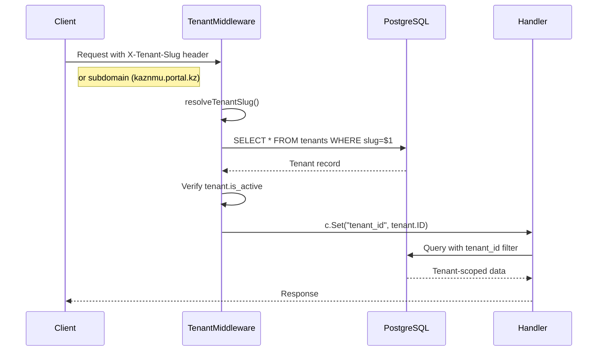

# Multitenancy Architecture

This document describes the multitenancy implementation in the PhD Student Portal, enabling multiple organizations (universities, colleges) to use a single application instance with data isolation.

---

## Table of Contents

1. [Overview](#overview)
2. [Architecture](#architecture)
3. [Database Schema](#database-schema)
4. [Tenant Resolution](#tenant-resolution)
5. [Service Configuration](#service-configuration)
6. [Superadmin Portal](#superadmin-portal)
7. [Frontend Integration](#frontend-integration)
8. [API Reference](#api-reference)

---

## Overview

The platform supports multiple tenants (organizations) with:

- **Complete data isolation** - Each tenant's data is separated by `tenant_id`
- **Custom branding** - Logo, colors, app name per tenant
- **Configurable services** - Enable/disable features per tenant (chat, calendar)
- **Subdomain routing** - `kaznmu.portal.kz`, `knu.portal.kz`
- **Superadmin management** - Cross-tenant administration

---

## Architecture

### Request Flow


<details>
<summary>Mermaid Source</summary>


</details>

### Data Isolation Pattern

All tenant-scoped tables include:
- `tenant_id uuid NOT NULL REFERENCES tenants(id)`
- Index on `tenant_id` for performance
- Foreign key constraint for referential integrity

---

## Database Schema

### Core Tables

#### `tenants`
```sql
CREATE TABLE tenants (
  id uuid PRIMARY KEY DEFAULT uuid_generate_v4(),
  slug text UNIQUE NOT NULL,           -- 'kaznmu', 'knu'
  name text NOT NULL,                   -- 'Kazakh National Medical University'
  domain text,                          -- Optional custom domain
  logo_url text,                        -- Tenant logo
  settings jsonb DEFAULT '{}',          -- Tenant-specific config
  is_active boolean DEFAULT true,
  enabled_services text[] DEFAULT ARRAY['chat', 'calendar'],
  tenant_type text DEFAULT 'university',
  app_name text,
  primary_color text,
  secondary_color text,
  created_at timestamptz DEFAULT now(),
  updated_at timestamptz DEFAULT now()
);
```

#### `user_tenant_memberships`
```sql
CREATE TABLE user_tenant_memberships (
  id uuid PRIMARY KEY DEFAULT uuid_generate_v4(),
  user_id uuid NOT NULL REFERENCES users(id) ON DELETE CASCADE,
  tenant_id uuid NOT NULL REFERENCES tenants(id) ON DELETE CASCADE,
  role text NOT NULL DEFAULT 'student',
  is_primary boolean DEFAULT false,
  joined_at timestamptz DEFAULT now(),
  UNIQUE(user_id, tenant_id)
);
```

### Tables with tenant_id

| Category | Tables |
|----------|--------|
| **Core** | `users`, `playbook_versions`, `node_instances`, `node_instance_slots`, `journey_states` |
| **Documents** | `documents`, `document_versions`, `node_instance_slot_attachments` |
| **Communication** | `chat_rooms`, `chat_room_members`, `chat_messages`, `notifications`, `admin_notifications` |
| **Calendar** | `calendar_events` |

### Migrations

| Migration | Purpose |
|-----------|---------|
| `0041_create_tenants` | Create tenants table, add is_superadmin to users |
| `0042_user_tenant_memberships` | User-to-tenant many-to-many relationship |
| `0043_add_tenant_id_core` | Add tenant_id to journey/document tables |
| `0044_add_tenant_id_communication` | Add tenant_id to chat/notification tables |
| `0046_tenant_services` | Add enabled_services array to tenants |

---

## Tenant Resolution

### Resolution Priority

1. **X-Tenant-Slug header** (highest priority)
2. **Subdomain** extraction from host
3. **Default** ("kaznmu" for localhost)

### Middleware Implementation

```go
// middleware/tenant.go
func TenantMiddleware(db *sqlx.DB) gin.HandlerFunc {
    return func(c *gin.Context) {
        slug := resolveTenantSlug(c)
        tenant, err := getTenantBySlug(db, slug)
        
        if !tenant.IsActive {
            c.JSON(403, gin.H{"error": "tenant is inactive"})
            c.Abort()
            return
        }
        
        c.Set("tenant_id", tenant.ID)
        c.Set("tenant_slug", tenant.Slug)
        c.Set("tenant", tenant)
        c.Next()
    }
}
```

### Helper Functions

| Function | Purpose |
|----------|---------|
| `GetTenantID(c)` | Get tenant UUID from context |
| `GetTenantSlug(c)` | Get tenant slug from context |
| `GetTenant(c)` | Get full tenant object from context |
| `RequireTenant()` | Middleware that rejects requests without tenant |

---

## Service Configuration

### Available Services

| Service | Default | Description |
|---------|---------|-------------|
| `chat` | ✅ Enabled | Real-time messaging between users |
| `calendar` | ✅ Enabled | Event scheduling and deadlines |

### Core Services (Always Enabled)

- Journey progression
- Document uploads
- Contacts management
- Notifications
- User profiles

### Frontend Service Visibility

```tsx
// contexts/TenantServicesContext.tsx
const { services } = useTenantServices();

// Check if service is enabled
if (services.includes('chat')) {
  // Show chat navigation
}
```

---

## Superadmin Portal

### Features

| Feature | Endpoint | Description |
|---------|----------|-------------|
| **Tenants CRUD** | `GET/POST/PUT/DELETE /superadmin/tenants` | Manage organizations |
| **Admins CRUD** | `GET/POST/PUT/DELETE /superadmin/admins` | Manage tenant admins |
| **Activity Logs** | `GET /superadmin/logs` | Cross-tenant audit trail |
| **Settings** | `GET/PUT /superadmin/settings` | Global configuration |

### Superadmin Access

```go
// Requires is_superadmin = true in users table
func RequireSuperadmin() gin.HandlerFunc {
    return func(c *gin.Context) {
        claims := ClaimsFromContext(c)
        if !claims.IsSuperadmin {
            c.JSON(403, gin.H{"error": "superadmin access required"})
            c.Abort()
            return
        }
        c.Next()
    }
}
```

### Tenant Configuration

Superadmins can configure:
- **Branding**: Logo, colors, app name
- **Type**: university, college, vocational, school
- **Services**: Enable/disable chat, calendar
- **Status**: Active/inactive

---

## Frontend Integration

### Components

| Component | Location | Purpose |
|-----------|----------|---------|
| `TenantSwitcher` | Header | Switch between tenants (multi-tenant users) |
| `TenantServicesContext` | Context | Service availability state |
| `TenantsPage` | Superadmin | Tenant management UI |

### Tenant Switcher

Only shown when user belongs to 2+ tenants:

```tsx
// components/TenantSwitcher.tsx
const { tenants, currentTenant, switchTenant } = useTenants();

if (tenants.length < 2) return null;

return (
  <DropdownMenu>
    {tenants.map(t => (
      <DropdownMenuItem onClick={() => switchTenant(t.slug)}>
        {t.name}
      </DropdownMenuItem>
    ))}
  </DropdownMenu>
);
```

### API Client Configuration

```ts
// lib/tenant.ts
const api = axios.create({
  headers: {
    'X-Tenant-Slug': getCurrentTenantSlug()
  }
});
```

---

## API Reference

### Tenant Endpoints

| Method | Endpoint | Auth | Description |
|--------|----------|------|-------------|
| GET | `/me/tenants` | User | List user's tenants |
| POST | `/me/tenant` | User | Switch current tenant |
| GET | `/tenants/:id` | Admin | Get tenant details |
| PUT | `/tenants/:id/services` | Admin | Update enabled services |

### Request Headers

| Header | Required | Example | Description |
|--------|----------|---------|-------------|
| `Authorization` | Yes | `Bearer <token>` | JWT access token |
| `X-Tenant-Slug` | Yes* | `kaznmu` | Target tenant (*or subdomain) |

### Example: Switch Tenant

```http
POST /api/me/tenant
Content-Type: application/json
Authorization: Bearer <token>

{
  "tenant_slug": "knu"
}
```

Response:
```json
{
  "tenant": {
    "id": "uuid",
    "slug": "knu",
    "name": "Karaganda National University"
  },
  "role": "student"
}
```
